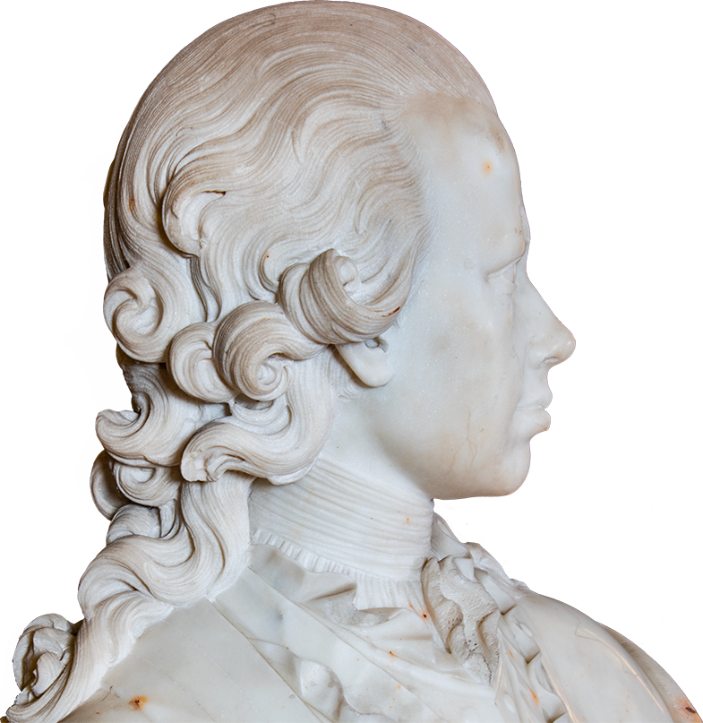

    <a href="https://www.accademiacarrara.it/img/mcybei/index.html">Link al sito</a>
    <a href="https://www.accademiacarrara.it/it/mostra-cybei-2021">Pubblicazione accademiacarrara.it</a>

La mostra “Giovanni Antonio Cybei e il suo tempo. Insigne statuario per le corti europee e Primario Direttore dell’Accademia di Belle Arti di Carrara” celebra il primo direttore dell’Accademia, lo scultore carrarese Giovanni Antonio Cybei (1706-1784), che operò per le più illustri case regnanti d’Italia e d’Europa. È promossa e realizzata dall’Accademia di Belle Arti di Carrara ed ideata e curata dal Prof. Gerardo de Simone e da Luciano Massari, Direttore dell’Accademia di Belle Arti di Carrara. Per la mostra, ho ideato e realizzato il design del sito web dell’evento.